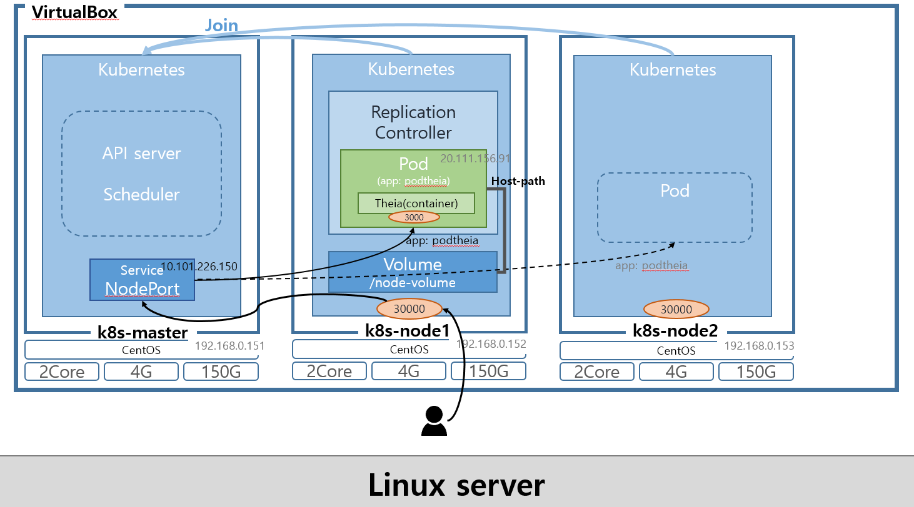

# Kubernetes Configration for Theia

> ## 목차
>
> 1. [구성도](#구성도)
> 2. [쿠버네티스 환경 구성](#kubernetes-setting)
>    1. [VM 스펙 설정](#1-vm-스펙-설정)
>    2. [CentOS 설치](#2-centos-설치)
>    3. [호스트 파일 시스템 설정](#3-호스트-파일-시스템-설정)
>    4. [방화벽 해제 및 네트워크 설정](#4-방화벽-해제-및-네트워크-설정)
>    5. [Docker 및 Kubernetes 설치](#5-docker-및-kubernetes-설치)
> 3. [Replication Controller](#replication-controller)
> 4. [Node Port](#node-port)

## 구성도



---

## Kubernetes Setting

### 1) VM 스펙 설정

1. [VM 생성 1단계] 머신 > 새로 만들기 클릭
2. [VM 생성 1단계] 이름 : k8s-master, 종류: Linux, 버전: Other Linux(64-bit)
3. [VM 생성 2단계] 메모리 : 4096 MB
4. [VM 생성 3단계] 하드디스크 : 지금 새 가상 하드 디스크 만들기 (VDI:VirtualBox 디크스 이미지, 동적할당, 150GB)
5. [VM 생성 후 시스템 설정] 프로세서 개수 : CPU 2개
6. [VM 생성 후 저장소 설정] 컨트롤러:IDE 하위에 있는 광학드라이브 클릭 > CentOS 이미지 선택 후 확인
7. [VM 생성 후 네트워크 설정] VM 선택 후 설정 버튼 클릭 > 네트워크 > 어댑터 1 탭 > 다음에 연결됨 [어댑터에 브리지] 선택
   - IP를 할당 받을 수 없는 경우 [NAT 네트워크]
8. 시작

### 2) CentOS 설치

1. Test this media & install CentOS 7
2. Language : 한국어
3. Disk 설정 [시스템 > 설치 대상]
   - [기타 저장소 옵션 > 파티션 설정] 파티션을 설정합니다. [체크] 후 [완료]
   - 새로운 CentOS 설치 > 여기를 클릭하여 자동으로 생성합니다. [클릭]
   - /home [클릭] 후 용량 5.12 GiB로 변경 [설정 업데이트 클릭]
   - / [클릭] 후 140 GiB 변경 후 [설정 업데이트 클릭]
   - [완료], [변경 사항 적용]
4. 네트워크 설정 [시스템 > 네트워크 및 호스트명 설정]
   - 호스트 이름: k8s-master [적용]
   - 이더넷 [설정]
     [일반] 탭
     - 사용 가능하면 자동으로 이 네트워크에 연결 [체크]
       [IPv4 설정] 탭
     - 방식: 수동으로 선택,
     - [Add] -> 주소: 192.168.0.30, 넷마스크 : 255.255.255.0, 게이트웨이: 192.168.0.1, DNS 서버 : 8.8.8.8
     - [저장][완료]
5. 설치시작
6. [설정 > 사용자 설정] ROOT 암호 설정
7. 설치 완료 후 [재부팅]

### 3) 호스트 파일 시스템 설정

- 쿠버네티스가 Pod Network에 필요한 호스트 파일 시스템에 액세스가 가능하도록 하기 위해서 필요한 설정

1. SELinux을 permissive로 변경

   ```
   setenforce 0
   ```

2. 리부팅시 다시 원복되기 때문에 아래 명령을 통해서 영구적으로 변경

   ```
   sed -i 's/^SELINUX=enforcing$/SELINUX=permissive/' /etc/selinux/config
   ```

3. 설정 확인 - Current mode:permissive
   ```
   sestatus
   ```

### 4) 방화벽 해제 및 네트워크 설정

1. firewalld 비활성화
   ```
   systemctl stop firewalld && systemctl disable firewalld
   ```
2. NetworkManager 비활성화
   ```
    systemctl stop NetworkManager && systemctl disable NetworkManager
   ```
3. iptables 커널 옵션 활성화

   - CentOS7 사용시 iptables가 무시되서 트래픽이 잘못 라우팅되는 문제가 발생할 수 있어, 아래와 같이 설정

   ```
   cat <<EOF >  /etc/sysctl.d/k8s.conf
   net.bridge.bridge-nf-call-ip6tables = 1
   net.bridge.bridge-nf-call-iptables = 1
   EOF

   sysctl --system
   ```

4. 쿠버네티스 YUM Repository 설정

   ```
   	 cat <<EOF > /etc/yum.repos.d/kubernetes.repo
   [kubernetes]
   name=Kubernetes
   baseurl=https://packages.cloud.google.com/yum/repos/kubernetes-el7-x86_64
   enabled=1
   gpgcheck=1
   repo_gpgcheck=0
   gpgkey=https://packages.cloud.google.com/yum/doc/yum-key.gpg https://packages.cloud.google.com/yum/doc/rpm-package-key.gpg
   EOF

    yum update -y
   ```

5. host 등록
   ```
   cat << EOF >> /etc/hosts
   192.168.0.151 k8s-master
   192.168.0.152 k8s-node1
   192.168.0.153 k8s-node2
   EOF
   ```

### 5) Docker 및 Kubernetes 설치

1. 도커 설치 전에 필요한 패키지 설치
   ```
   yum install -y yum-utils device-mapper-persistent-data lvm2
   ```
2. 도커 설치를 위한 저장소 를 설정
   ```
   yum-config-manager --add-repo https://download.docker.com/linux/centos/docker-ce.repo
   ```
3. 도커 패키지 설치

   ```
   yum update -y && yum install -y docker-ce-18.06.2.ce

   mkdir /etc/docker
   cat > /etc/docker/daemon.json <<EOF
   {
   	"exec-opts": ["native.cgroupdriver=systemd"],
   	"log-driver": "json-file",
   	"log-opts": {
   		"max-size": "100m"
   	},
   	"storage-driver": "overlay2",
   	"storage-opts": [
   		"overlay2.override_kernel_check=true"
   	]
   }
   EOF

   mkdir -p /etc/systemd/system/docker.service.d
   ```

4. Kubernetes 설치
   ```
   yum install -y --disableexcludes=kubernetes kubeadm-1.15.5-0.x86_64 kubectl-1.15.5-0.x86_64 kubelet-1.15.5-0.x86_64
   ```

### 6) 노드 생성을 위한 VM Clone 및 설정

1. 이미지 복사를 위한 Master node shutdown

   ```
   shutdown now
   ```

2. VM 복사

   1. VirtualBox UI를 통해 Master 선택 후 마우스 우클릭을 해서 [복제] 버튼 클릭
   2. 이름 : k8s-node1, MAC 주소정책 : 모든 네트워크 어댑터의 새 MAC 주소 생성
   3. 복제방식 : 완전한 복제

3. node2도 반복

4. Network 변경
   1. VirtualBox UI에서 k8s-node1을 시작 시키면 뜨는 Console 창을 통해 아래 명령어 입력
      ```
      vi /etc/sysconfig/network-scripts/ifcfg-eth0
      ```
   2. IPADDR= 부분을 해당 Node의 IP (192.168.0.152)로 변경
      ```
      ...
      DEVICE="etho0"
      ONBOOT="yes"
      IPADDR="192.168.0.31"
      ...
      ```
   3. 네트워크 재시작
      ```
      systemctl restart network
      ```
   4. Host Name 변경
      ```
      hostnamectl set-hostname k8s-node1
      ```
   5. 이와 같은 방식으로 k8s-node2(192.168.0.153) 도 설정

---

## Replication Controller

```yaml
apiVersion: v1
kind: ReplicationController
metadata:
name: replication-1
spec:
replicas: 1
selector:
  app: podtheia
template:
  metadata:
    name: podtheia
    labels:
      app: podtheia
  spec:
    securityContext:
      runAsUser: 1000
      fsGroup: 1000
    volumes:
      - name: host-path
        hostPath:
          path: /node-volume
          type: DirectoryOrCreate
    nodeSelector:
      kubernetes.io/hostname: k8s-node1
    containers:
      - name: theia
        image: gashirar/theia-kubernetes
        volumeMounts:
          - name: host-path
            mountPath: /home/project
        ports:
          - containerPort: 3000
        env:
          - name: NO_AUTH
            value: "true"
```

---

## Node Port

```yaml
apiVersion: v1
kind: ReplicationController
metadata:
  name: replication-1
spec:
  replicas: 1
  selector:
    app: podtheia
  template:
    metadata:
      name: podtheia
      labels:
        app: podtheia
    spec:
      nodeSelector:
        kubernetes.io/hostname: k8s-node1
      containers:
        - name: theia
          image: gashirar/theia-kubernetes
          volumeMounts:
            - name: host-path
              mountPath: /home/project
          ports:
            - containerPort: 3000
          env:
            - name: NO_AUTH
              value: "true"
      volumes:
        - name: host-path
          hostPath:
            path: /node-volume
            type: DirectoryOrCreate
```
